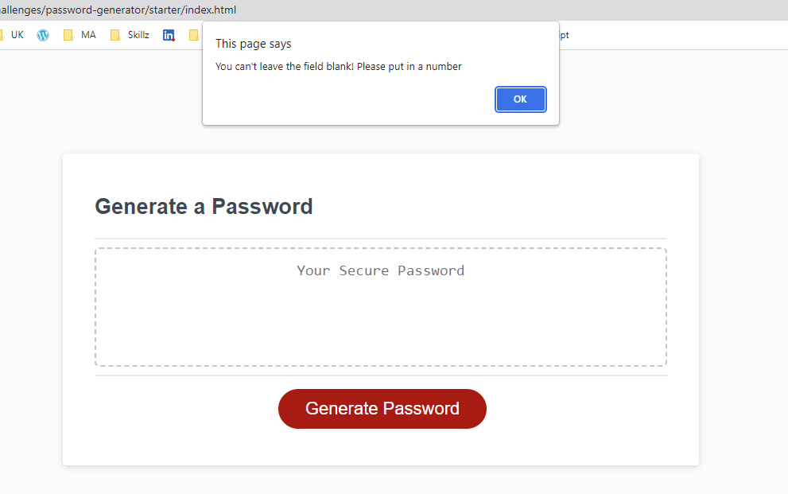
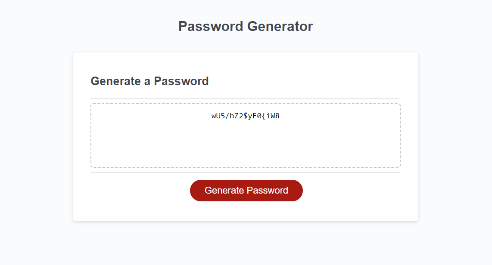

# Random Password Generator

## Description

This is a code for a [Random Password Generator](https://maijako.github.io/password-generator).

It features a simple responsive design and an interactive button that triggers password criteria selection options from a user before generating a password that matches them:

The logic was written using JavaScript, and user input data was validated through a combination of functions, nested while loops and conditional statements, that help prompt user to input a valid value:

And return a valid password that satisfies the selected criteria:

## Usage

The app can be used to generate random passwords that are 10 to 64 characters in length and contain at least one of the following:
* lowercase characters
* uppercase characters
* numeric characters
* special characters

## Credits

The source code and the original asset files were provided by [Trilogy Education](https://2u.com/) as part of the Front End Web Development bootcamp sponsored by the [Skills For Life](https://skillsforlife.edx.org/) program.

## Licence

This code uses MIT License.

